# C4009143 ARTIFICIAL INTELLIGENCE AND MACHINE LEARNING 1

## 1. Overview

This project implements a complete end to end machine learning workflow for analysing road collion data in Sheffield. It uses the /dft-road-casualty-statistics-collision-1979-latest-published-year.csv dataset, filtered to Sheffield city.

The pipeline covers:

    • Data preprocessing and feature engineering.
    • Supervised classification (Decision tree, KNN, Logistics regression and a Neural network).
    • Regression analysis (Simple linear, Multiple linear and Polynomial).
    • Unsupervised clustering (K-means and DBSCAN).
    • Dimensionality reduction.
    • Responsible AI checks.

All results are printer to the terminal with a matplotlib visualisation displayed as a pop-up plot.

---
## 2. File structure 

Place all four Python files in the same folder as the dataset CSV before running.
 
| File | Description |
|------|-------------|
| `Main.py` | Entry point. Runs the full pipeline and generates all plots. |
| `Preprocessing.py` | Data loading, cleaning, imputation and feature engineering. |
| `Models.py` | All model training, tuning and evaluation functions. |
| `Config.py` | Constants, file paths, feature lists and logging setup. |
| `dft-road-casualty-statistics-collision-1979-latest-published-year.csv` | The DfT collision dataset. Must be in the same folder as the Python files. |

## 3. Installation
 
### 3.1 Requirements
 
Python 3.10 or higher is required. This project was developed and tested on Python 3.13.
 
### 3.2 Install Dependencies
 
Run the following command in your terminal:
 
```
pip install pandas numpy matplotlib seaborn scikit-learn
```
 
### 3.3 Dataset
 
Download the dataset from the google drive, You must use SHU's Gmail account (YourStudentID@my.shu.ac.uk) for accessing any links provided within this
document.:
 
```
https://drive.google.com/drive/folders/18Jbx5jUGfR3H13xoDDpvIVsCmoT8SvQB?usp=sharing
```
 
The file needed is:
 
```
dft-road-casualty-statistics-collision-1979-latest-published-year.csv
```
 
Place this CSV in the same directory as the Python files before running.
 
---

## 4. Usage
 
### 4.1 Running the Program
 
Navigate to the project folder in your terminal and run:
 
```
python Main.py
```
 
The program runs automatically from start to finish. No user input is required during execution. Matplotlib plot windows appear sequentially - close each one to continue to the next step.
 
### 4.2 Expected Run Time
 
| Stage | Approximate Time |
|-------|-----------------|
| Preprocessing | 45-60 seconds |
| EDA Plots | Depends on how quickly you close windows |
| Classification | 2-3 minutes |
| Regression | 1-2 minutes |
| Clustering (K-Means + DBSCAN) | 4-6 minutes |
| PCA | Under 1 minute |
| **Total (excluding plots)** | **Approximately 10-15 minutes** |
 
---

## 5. Dependencies
 
| Library | Purpose |
|---------|---------|
| `pandas` | Data loading, filtering and manipulation |
| `numpy` | Numerical operations and array handling |
| `matplotlib` | Generating all visualisation plots |
| `seaborn` | Statistical plot styling built on matplotlib |
| `scikit-learn` | All machine learning models and evaluation metrics |
| `logging` | Timestamped terminal progress output (built-in) |
 
---

## 6. Pipeline Overview
 
### 6.1 Preprocessing
 
1. Loads the full UK dataset and filters to Sheffield rows (authority code 215)
2. Replaces DfT sentinel value -1 with NaN then applies staged imputation
3. Forward fills two severity adjustment columns (time-ordered data)
4. Mean imputes standard numeric columns
5. Mode imputes string/categorical columns
6. Removes GPS coordinate outliers outside the Sheffield bounding box
7. Converts date/time strings to proper types and extracts month and hour
8. Engineers four binary features: is_rush_hour, is_weekend, is_dark, is_bad_weather
### 6.2 Classification
 
- K-Fold cross validation (k=5) comparing Decision Tree, KNN and Logistic Regression
- Decision Tree multiclass: predicts Fatal / Serious / Slight with class_weight=balanced
- Decision Tree binary: predicts Urban vs Rural collision location
- Decision Tree categorical: predicts junction type from road features
- Neural Network (MLP): two hidden layers (64, 32) with ReLU activation
- Hyperparameter tuning via validation set for all Decision Tree models
### 6.3 Regression
 
- Simple Linear Regression: models the yearly decline in collision count (R2 = 0.93)
- Multiple Linear Regression: predicts number of casualties from 22 features
- Polynomial Regression: tests degrees 2, 3 and 4 to predict number of vehicles involved
### 6.4 Clustering
 
- K-Means risk clustering: groups collisions by road conditions, elbow method and silhouette score used to select optimal k
- Geographic clustering: K-Means with k=5 on latitude/longitude to identify hotspot zones across Sheffield
- DBSCAN: density-based clustering with hyperparameter grid search over eps and min_samples
### 6.5 PCA
 
- Fits PCA to the 20 classification features
- Identifies the number of components needed to retain 95% of variance (17 of 20)
- Compares Decision Tree accuracy with and without PCA reduction
### 6.6 Responsible AI
 
- Prints class distribution to highlight the severe Fatal underrepresentation (0.9%)
- Prints top 5 feature importances from the Decision Tree for explainability
- Class imbalance plot shown for visual documentation of bias
---
 
## 7. Configuration
 
All constants are defined in Config.py. Key settings:
 
| Constant | Value | Description |
|----------|-------|-------------|
| `dataset_path` | CSV filename | Path to the collision dataset |
| `Sheff_code` | 215 | Sheffield local authority district code |
| `Rand_state` | 42 | Fixed random seed for reproducibility |
| `test_size` | 0.4 | Proportion of data held back for val/test |
| `val_size` | 0.5 | Split of held-back data between val and test |
| `kfold_splits` | 5 | Number of folds for cross validation |
| `Lat_min / Lat_max` | 53.3 / 53.5 | Sheffield latitude bounding box |
| `Lon_min / Lon_max` | -1.8 / -1.3 | Sheffield longitude bounding box |
 
---
 
 
---

## 8. Exploratory Data Analysis
 
### Collisions by Year
 
Sheffield collisions show a clear downward trend from approximately 1,900 per year in 1998 to under 800 by 2021. This long-term decline is captured by the Simple Linear Regression model (R2 = 0.93).
 
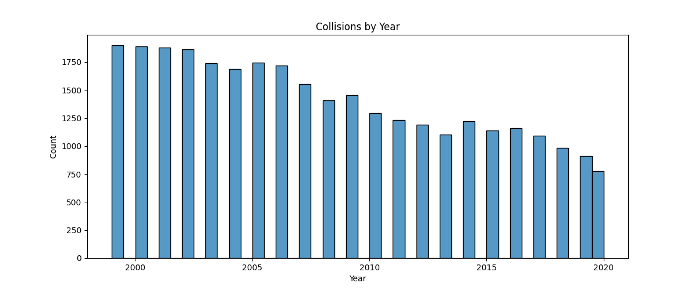
 
---
 
### Collisions by Hour of Day
 
Two distinct peaks are visible — a morning rush hour peak around 8am and a larger afternoon peak between 15:00 and 17:00. This pattern directly motivated the `is_rush_hour` engineered feature.
 
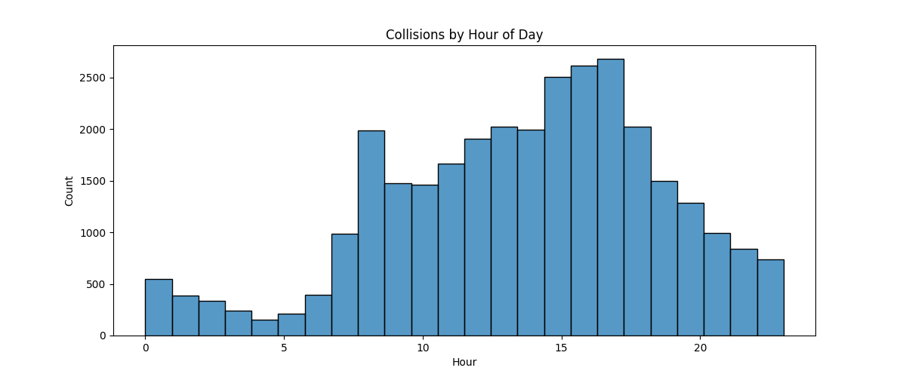
 
---
 
### Collisions by Month
 
Collisions are slightly higher in autumn and winter months (October to January) and lowest in August. November is the most dangerous month, likely due to darker evenings and worsening road conditions.
 
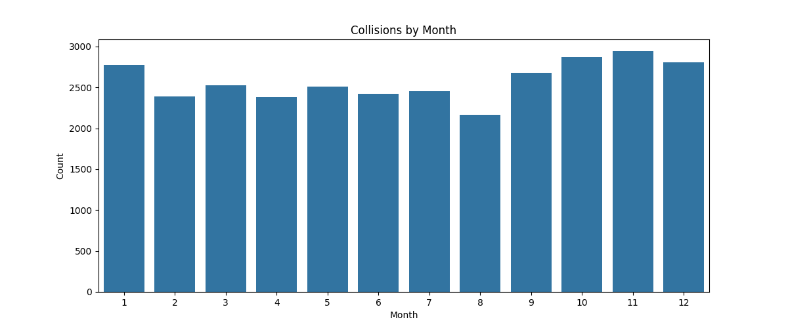
 
---
 
### Collision Severity by Weather Conditions
 
The majority of collisions occur in fine weather (code 1) simply because that is when most driving takes place. Rain (code 2) is the second most common condition. All weather codes with bad conditions (2, 3, 5, 6, 7) are grouped into the `is_bad_weather` engineered feature.
 
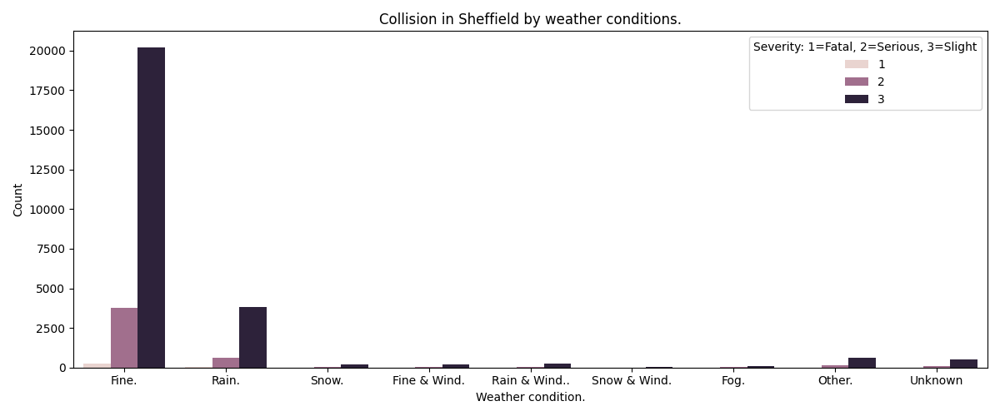
 
---
 
### Collision Severity by Light Conditions
 
Most collisions occur in daylight (code 1). Dark with street lighting (code 4) is the second highest, reflecting Sheffield's urban road network. Codes 5, 6 and 7 represent increasingly dark conditions with minimal lighting and appear mainly on rural outskirts.
 
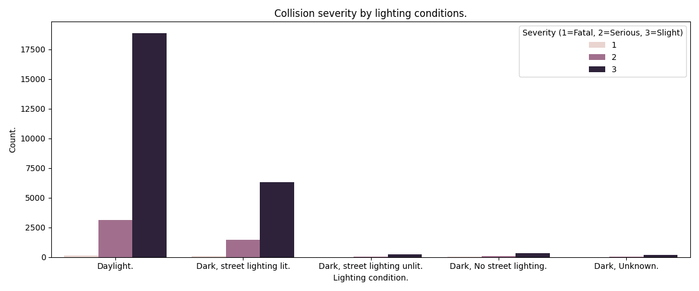
 
---
 
### Sheffield Collision Map by Location and Severity
 
All 30,932 collisions plotted by GPS coordinates and coloured by severity. Sheffield's road network is clearly visible — the dense city centre hotspot and major arterial routes radiating outward. Fatal collisions (red) are sparse and scattered, Serious (orange) follow main roads, Slight (blue) dominate everywhere.
 
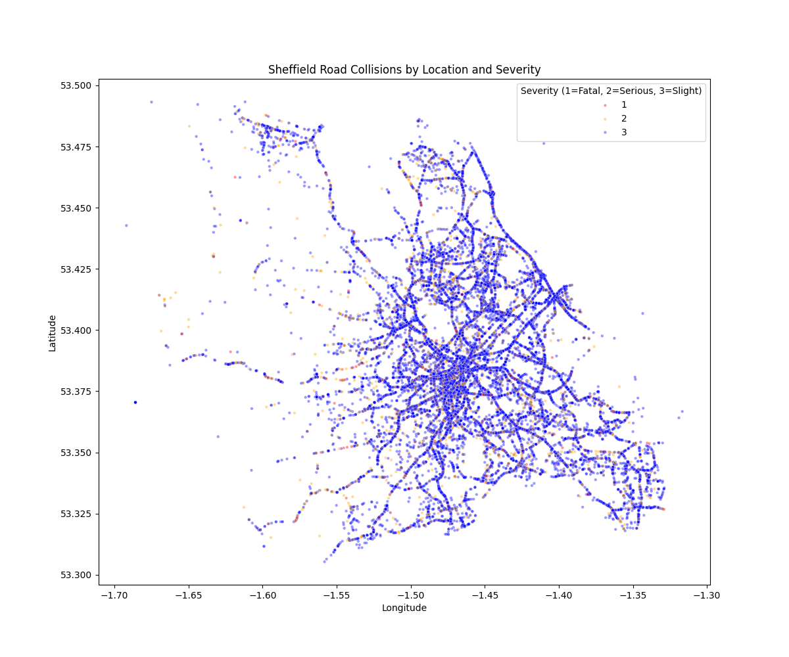
 
---
## 8. Example Output
 
### Classification - Decision Tree Multiclass Confusion Matrix
 
The multiclass Decision Tree uses class_weight=balanced to compensate for the severe class imbalance. The model correctly identifies 31 Fatal and 455 Serious collisions but over-predicts Fatal due to the balancing.
 
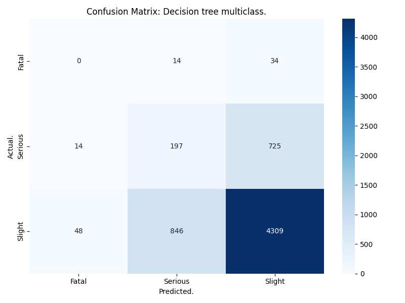
 
---
 
### Classification - Feature Importance (Balanced)
 
With class_weight=balanced applied, did_police_officer_attend_scene_of_accident and speed_limit are the most important features, making intuitive sense as police attend more serious incidents and higher speeds correlate with severity.
 
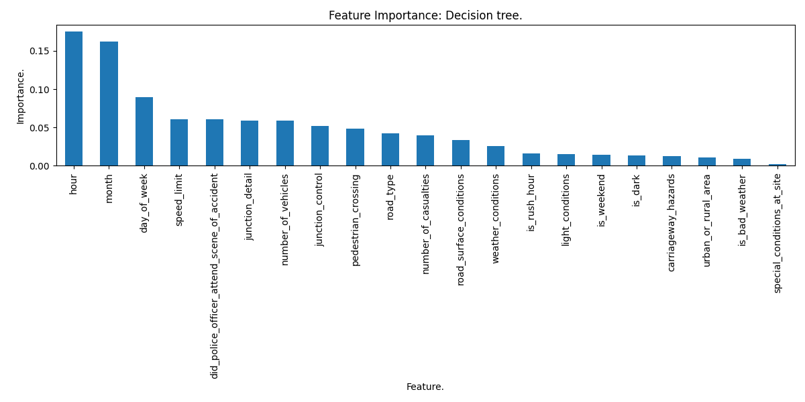
 
---
 
### Classification - Feature Importance (Unbalanced)
 
Without class balancing, did_police_officer_attend_scene_of_accident (48%) and number_of_vehicles (41%) dominate but the model only predicts Slight for everything.
 
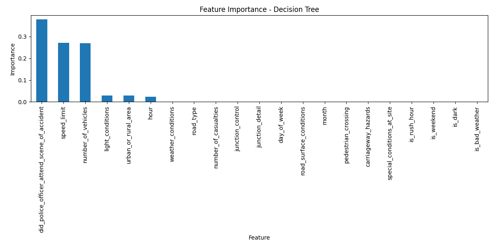
---
 
### Classification - Decision Tree Binary Confusion Matrix
 
Binary classification of Urban vs Rural achieves 94.4% accuracy. The model correctly identifies 5,663 urban collisions but struggles with rural (only 176 of 498 correct) due to class imbalance.
 
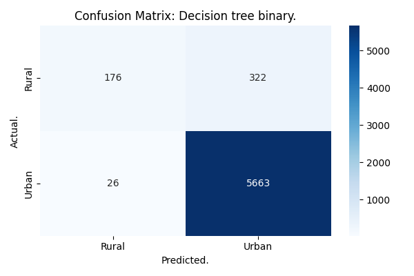
 
---
 
### Classification - Decision Tree Categorical Confusion Matrix
 
Categorical classification of junction type achieves 78% accuracy. Category 0 (not at junction) performs well at 98% but minority junction types score poorly.
 
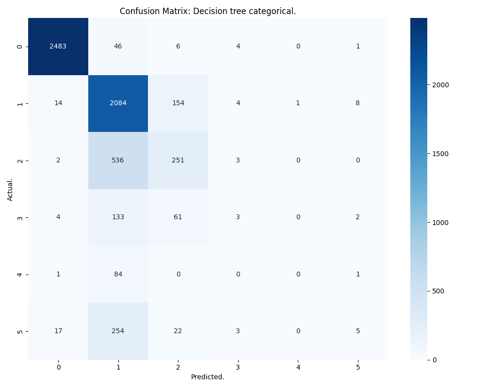
 
---
 
### Regression - Simple Linear Regression
 
Simple Linear Regression on annual collision counts achieves R2 = 0.93. Sheffield sees a clear downward trend of approximately 55 fewer collisions per year driven by road safety improvements.
 
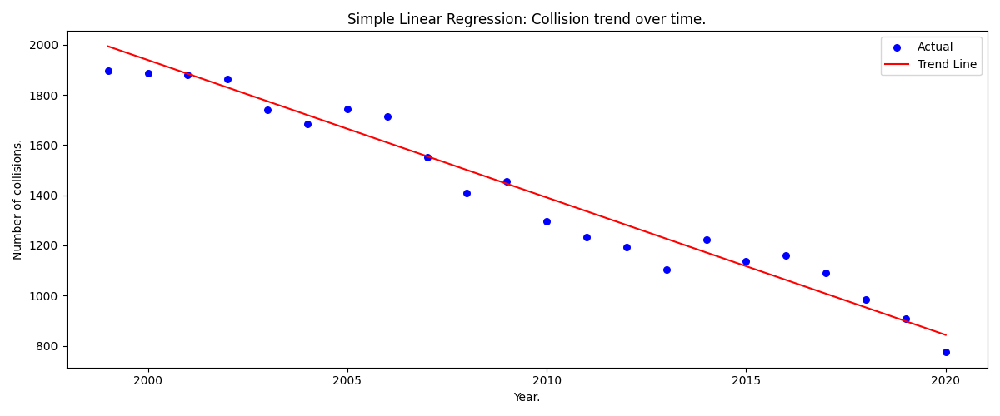
 
---
 
### Regression - Multiple Linear Regression
 
Predicting number of casualties from 22 road and environmental features. Low R2 (0.07) is expected - the vast majority of collisions result in exactly one casualty regardless of conditions.
 
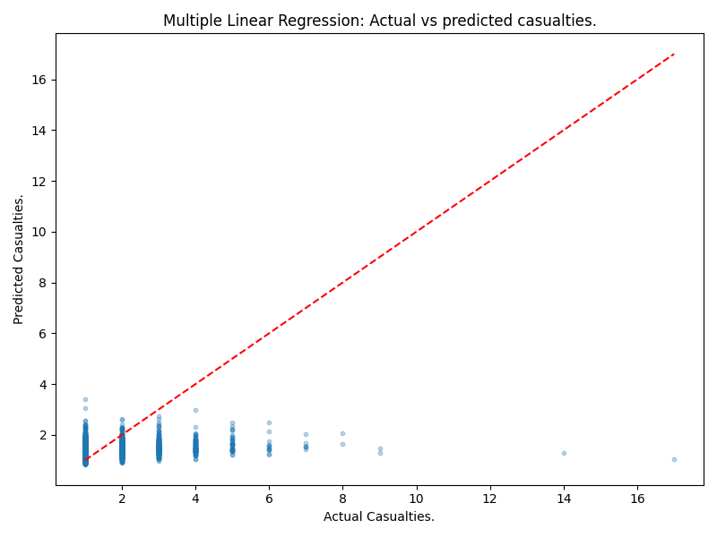
 
---
 
### Regression - Polynomial Regression
 
Polynomial regression (degree=2 selected as best) for predicting number of vehicles involved. Low R2 (0.04) shows that environmental features alone cannot reliably predict vehicle counts.
 
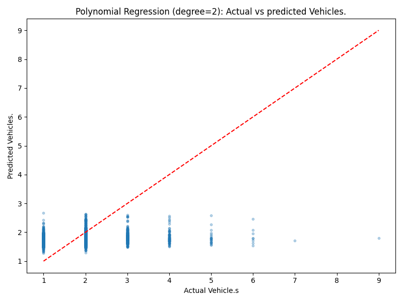
 
---
 
### Clustering - Elbow Method
 
The elbow method shows no sharp bend, indicating collisions do not form strongly separated natural groups. This is typical for real-world road collision data.
 
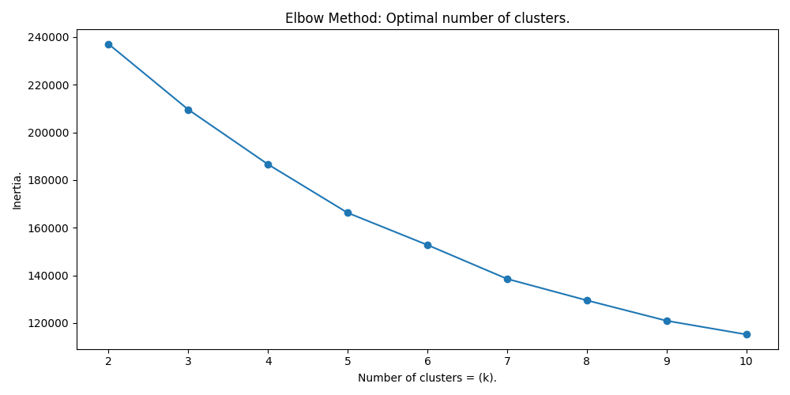
 
---
 
### Clustering - Silhouette Score
 
Silhouette scores across k=2 to k=10 confirm k=2 as the optimal number of clusters (score = 0.40).
 
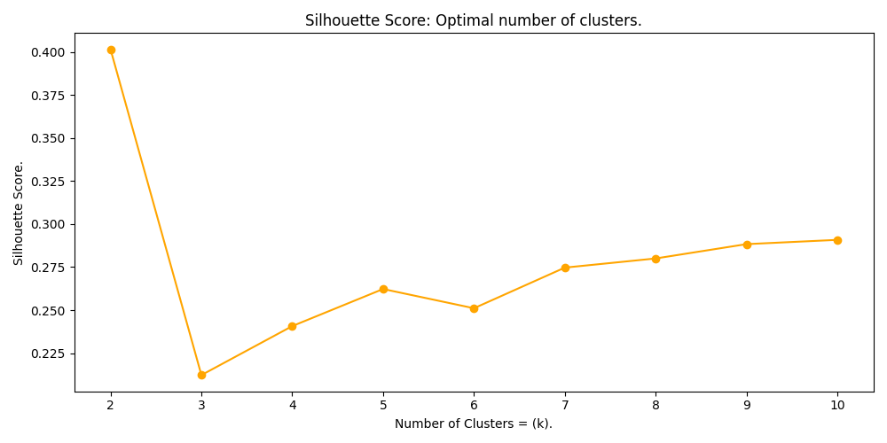
 
---
 
### Clustering - K-Means PCA Visualisation
 
K-Means clusters (k=2) projected onto 2D via PCA. Cluster 0 represents lower speed urban collisions (~31mph average), Cluster 1 represents higher speed rural collisions (~50mph average).
 
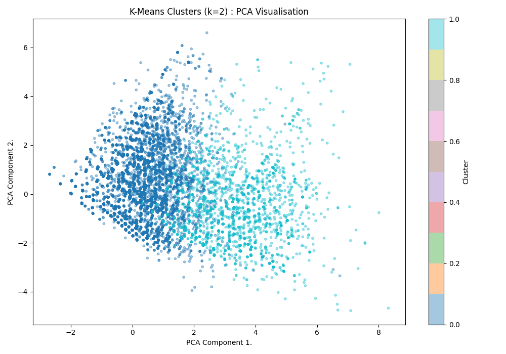
 
---
 
### Clustering - Geographic Hotspot Clusters
 
Five geographic zones identified across Sheffield using K-Means on latitude and longitude. The red cluster in the centre shows the dense city centre hotspot.
 
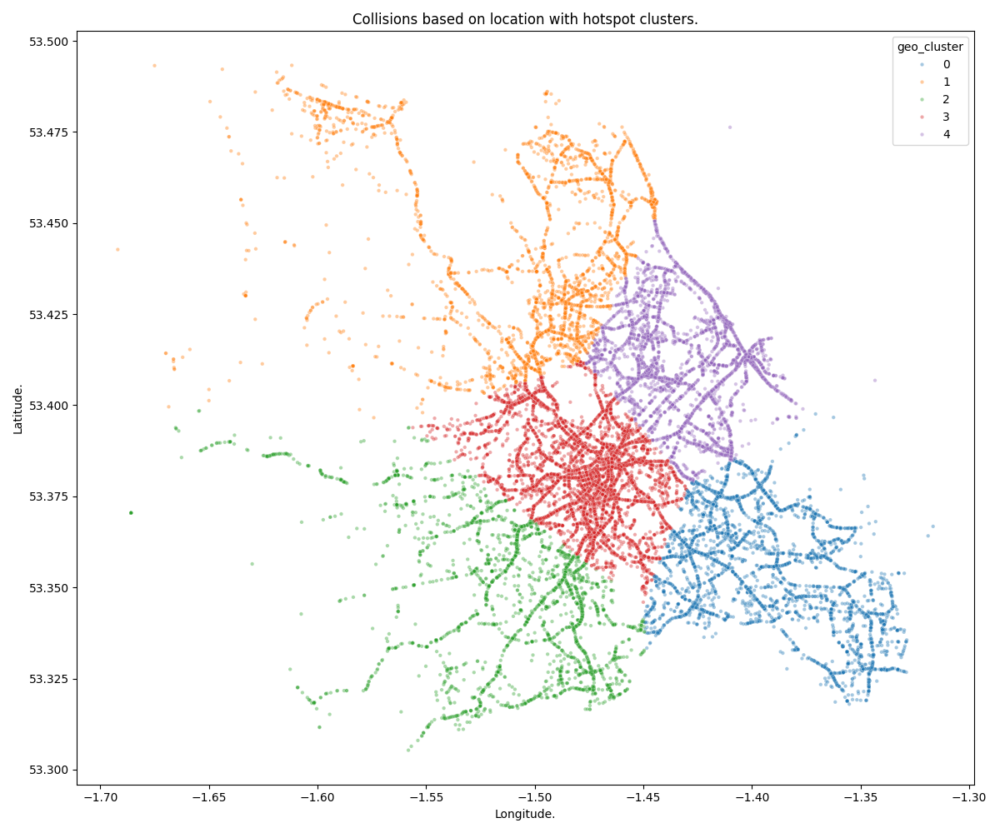
 
---
 
### Clustering - DBSCAN PCA Visualisation
 
DBSCAN over-clusters this dataset (317+ clusters) due to many collisions sharing identical encoded condition values. Documented as a known limitation.
 
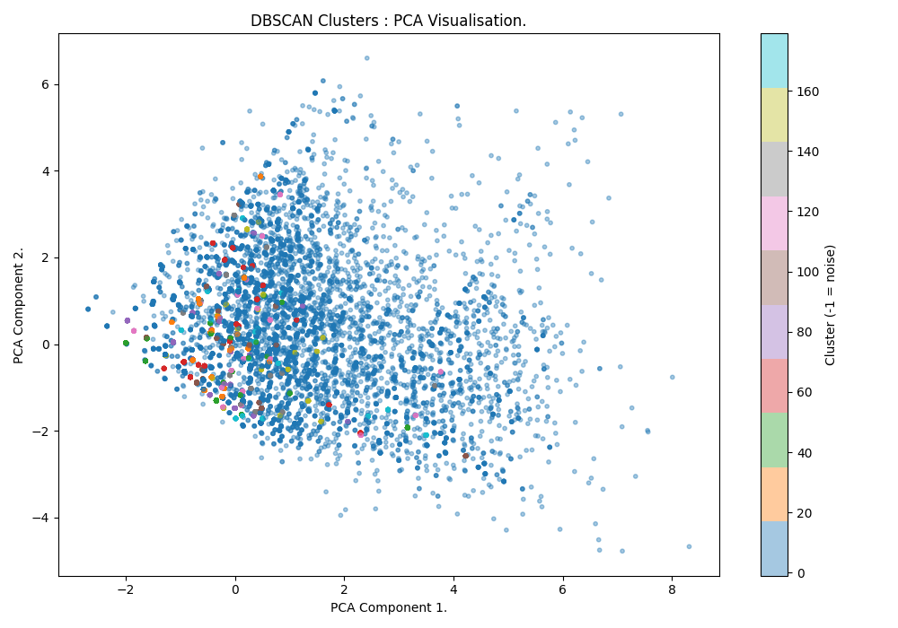
 
---
 
### PCA - Explained Variance
 
17 of 20 components are needed to retain 95% of variance, showing that the classification features are relatively uncorrelated with each other. Decision Tree accuracy improves slightly with PCA applied (84.1% vs 83.4%).
 
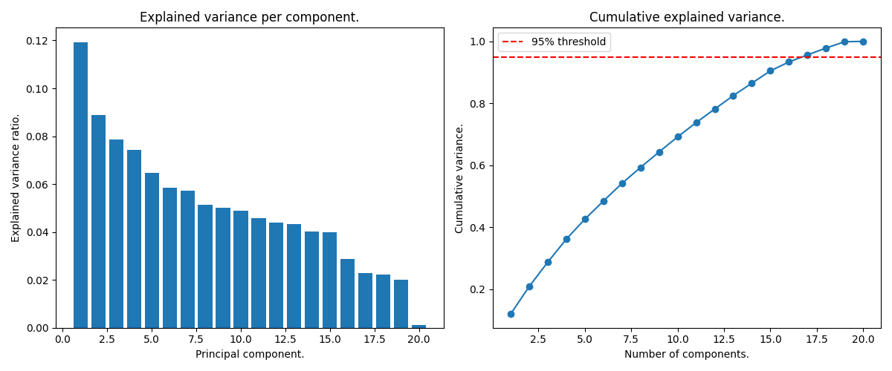
 
---
 
### Performance - Classification Accuracy
 
Model accuracy comparison against the 80% target. Most models exceed the target. Decision Tree categorical (78%) falls slightly below due to minority class difficulty.
 
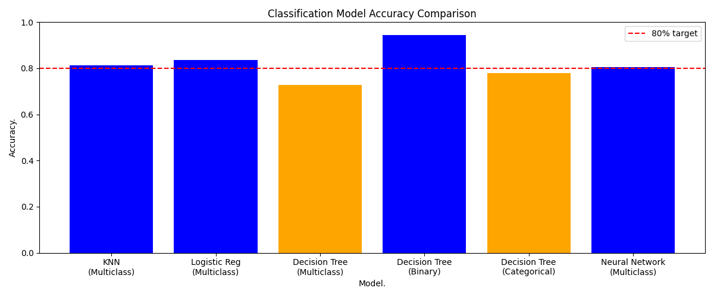
 
---
 
### Performance - Regression R2 Scores
 
Simple Linear Regression achieves R2 = 0.93. Multiple Linear and Polynomial score low as casualties and vehicles are difficult to predict from road conditions alone.
 
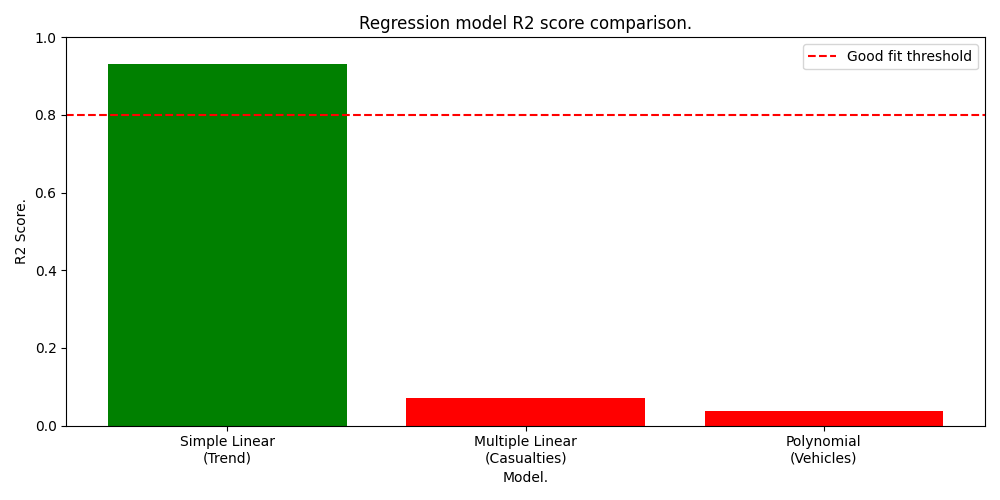
 
---
 
### Performance - Clustering Silhouette Scores
 
Both K-Means models score below the 0.5 threshold, reflecting the naturally overlapping nature of road collision condition groups.
 
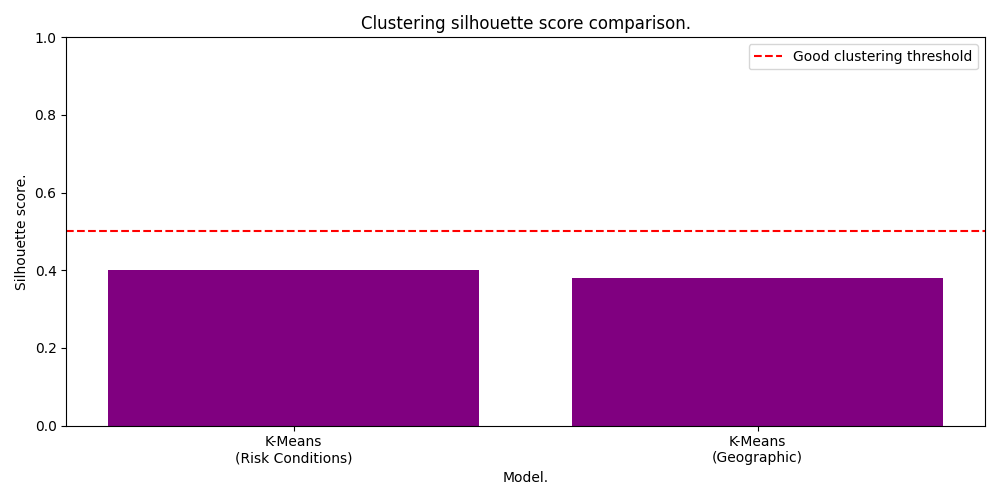
 
---
 
### Responsible AI - Class Distribution
 
The severe imbalance between Slight (83.7%), Serious (15.4%) and Fatal (0.9%) collisions directly impacts model performance on minority classes and is a key ethical consideration.
 
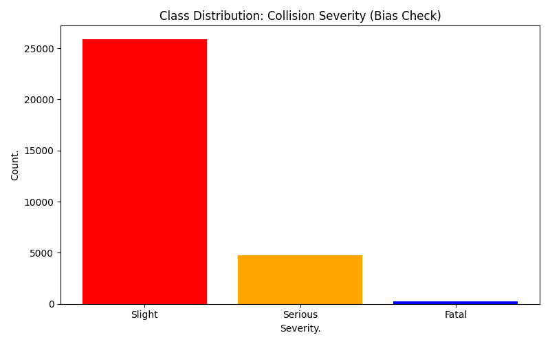
 
---
 
## 9. Known Limitations
 
- Fatal collision prediction is poor across all models due to severe class imbalance (only 0.9% of records)
- Multiple linear regression R2 of 0.07 for casualties is expected - most collisions result in exactly one casualty regardless of conditions
- DBSCAN over-clusters this dataset (317+ clusters) due to many collisions sharing identical encoded condition values
- Mean imputation of categorical codes such as weather and light conditions produces invalid code values like 0, which are filtered out in plots but remain in training data
- Dataset covers only collisions reported to police - unreported collisions are not represented
---
 
## 10. AI Transparency Declaration
 
**AI Transparency Scale: AITS Level 2 - AI for Shaping**
 
Artificial Intelligence tools were used at AITS Level 2 to shape parts of this assessment. AI was used for the following specific purposes:
 
- Initial concept development and structuring of the machine learning pipeline
- Debugging specific error messages during development
- Explaining unfamiliar library functions and sklearn API usage
- Suggesting approaches for handling class imbalance and imputation strategies
The majority of the implementation was human-developed. All AI suggestions were reviewed, tested, modified and integrated by the student.
---
 
## 11. References
 
- Department for Transport (2024). Road Safety Open Data. https://www.gov.uk/government/statistical-data-sets/road-safety-open-data
- Pedregosa et al. (2011). Scikit-learn: Machine Learning in Python. JMLR 12, pp. 2825-2830.
- McKinney, W. (2010). Data Structures for Statistical Computing in Python. Proceedings of the 9th Python in Science Conference.
- Hunter, J.D. (2007). Matplotlib: A 2D Graphics Environment. Computing in Science and Engineering, 9(3), pp. 90-95.